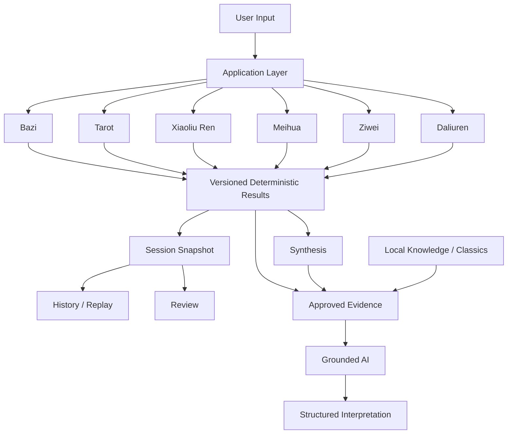
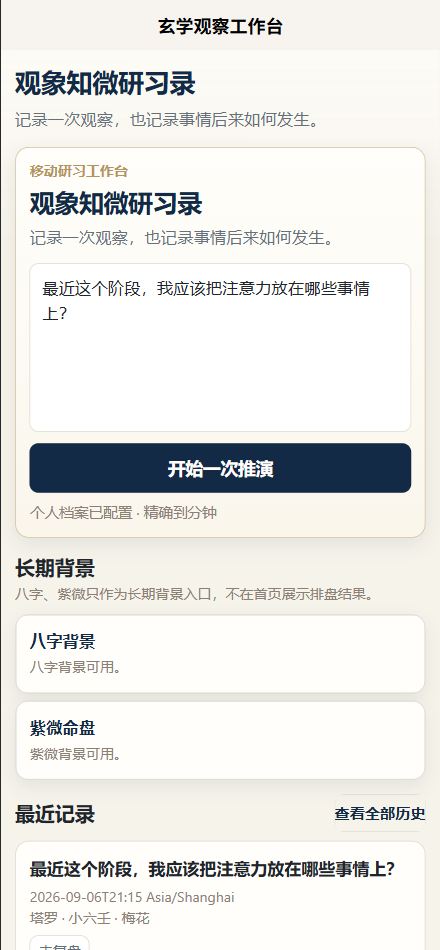
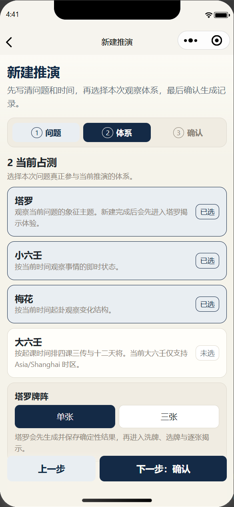
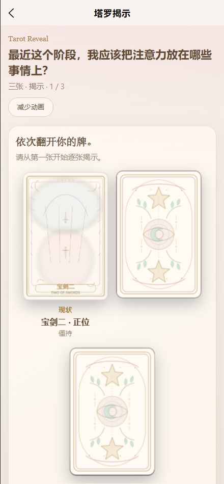
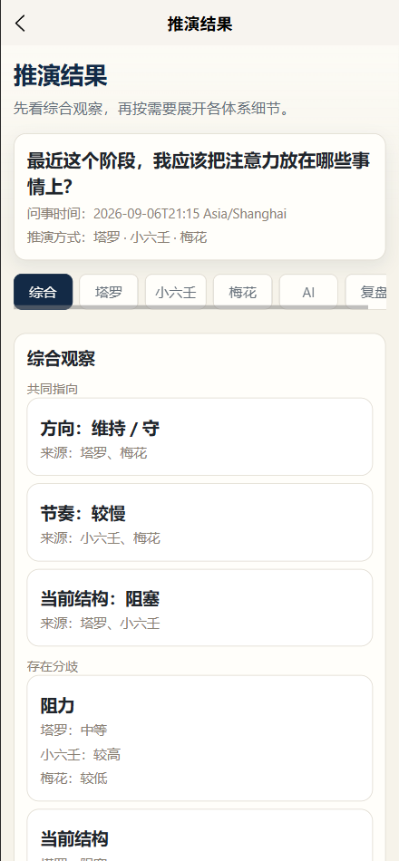
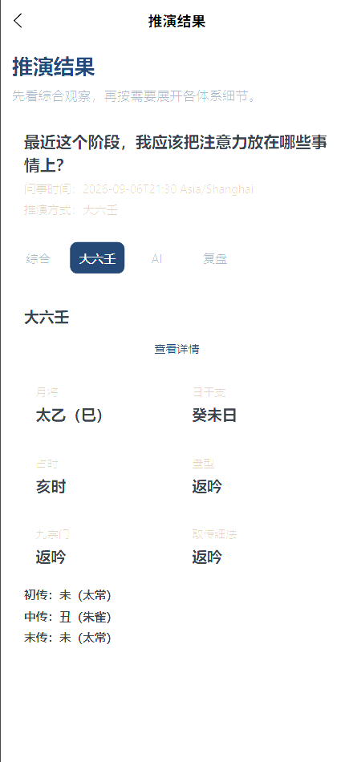

# 观象知微研习录

> A local-first AI-assisted traditional culture study workbench.

<p align="center">
  <a href="#project-highlights"><b>Project Highlights</b></a>
  ·
  <a href="#architecture"><b>Architecture</b></a>
  ·
  <a href="docs/architecture.md"><b>Architecture Case Study</b></a>
  ·
  <a href="#product-preview"><b>Product Preview</b></a>
</p>

<p align="center">
  Deterministic Systems · Grounded AI · Reproducible Sessions · Local-first
</p>

---
**观象知微研习录** 是一个面向个人研习、观察与复盘的传统文化工具，也是一个关于 **确定性系统与生成式 AI 如何协作** 的 AI 应用工程项目。

这个项目重点探索：

> 如何让 AI 负责“解释”，而不是接管应用的事实来源？

因此，核心架构采用：

```text
User Input
    ↓
Deterministic Engines
    ↓
Versioned Results
    ↓
Session Snapshot
    ↓
Approved Evidence
    ↓
Grounded AI
    ↓
Structured Interpretation
```

---
## Project Highlights

- Deterministic calculation engines
- Grounded AI interpretation
- Structured AI outputs
- Evidence validation
- Replayable historical sessions
- Versioned rules and snapshots
- Local-first persistence
- H5 + WeChat Mini Program
- Vue 3 + TypeScript + uni-app
- 600+ automated tests
- Local 78-card Tarot asset architecture
- WeChat subpackage optimization

很多 AI 应用采用：

```text
User Input
    ↓
LLM
    ↓
Answer
```

这种方式实现很快，但对于包含明确规则、历史记录和可验证状态的应用，会带来一些问题：

同样输入可能产生不同“计算结果”
AI 推测和确定性结果难以区分
Prompt 改变后历史结果可能变化
很难复现旧状态
很难测试 AI 与业务逻辑的边界

这个项目采用不同的方式：

Deterministic Result
        ↓
Persisted Snapshot
        ↓
Evidence Builder
        ↓
Grounded AI Context
        ↓
Structured AI Response

AI 不负责决定底层结果。

AI 只解释已经确定并持久化的结果。

## Architecture

👉 **[Read the architecture case study](docs/architecture.md)**


## AI Boundary

AI 可以接收：

- persisted deterministic results
- approved knowledge evidence
- approved classical references
- limited synthesis conclusions

AI 不负责：

- changing deterministic results
- drawing Tarot cards
- recalculating historical sessions
- silently replacing stored rule versions
- using unrestricted external knowledge as application truth

核心原则：

AI is an interpreter, not the source of truth.

## Reproducibility

每个 Session 会保存与结果复现有关的信息，例如：

```text
Input
Result
Rule Version
Engine Version
Schema Version
Seed
```

历史记录优先读取当时保存的 snapshot，而不是使用新的 Profile 或最新规则重新计算。

## Tarot Reveal

Tarot Reveal 是 presentation layer，而不是第二次抽牌。

真实数据流：

```text
Deterministic Tarot Engine
        ↓
Persisted Tarot Result
        ↓
Reveal Animation
```

用户点击视觉牌背，只触发已经确定的下一张牌面展示，不改变：

card identity
card order
upright / reversed orientation
## Local-first

核心数据优先保存在本地：

```text
Profile
RuleConfig
Sessions
AI Threads
Reviews
Backup
```
项目核心流程不依赖：

account
payment
social features
mandatory cloud sync
## Tech Stack

### Frontend

- Vue 3
- TypeScript
- uni-app
- Vite

### Platforms

- H5
- WeChat Mini Program

### Architecture

- deterministic domain engines
- application services
- repository abstraction
- adapters
- versioned snapshots
- local-first persistence

### AI

- grounded context construction
- evidence validation
- structured outputs
- conversational follow-up
- deterministic / generative separation
## Quality

Current automated verification:

Frontend
78 test files
657 tests

Server
4 test files
17 tests

Coverage includes:

deterministic replay
Session integrity
no-recalculation history
synthesis rules
Birth Input precision
AI evidence boundaries
backup compatibility
Tarot manifest completeness
presentation/domain isolation
## Product Preview

### Home

<p align="center">
  
</p>

### Divination Workflow

<p align="center">
  
</p>

### Tarot Reveal

<p align="center">
  
</p>

### Cross-engine Synthesis

<p align="center">
  
</p>

### Daliuren Deterministic Result

<p align="center">
  
</p>
## Current Status

The project is currently paused after completing the main application architecture and production Tarot Reveal flow.

Completed areas include:

Bazi
Tarot
Xiaoliu Ren
Meihua Yishu
Ziwei Doushu
Daliuren
Synthesis
Grounded AI
History
Review
Backup / Restore
Birth Input V2
Tarot Reveal
78-card local Tarot asset coverage

Current remaining work focuses mainly on:

final mobile polish
physical-device acceptance
further Tarot artwork refinement
long-term usage feedback
## What This Project Demonstrates

This project demonstrates:

deterministic systems around generative AI
grounded AI application architecture
reproducible historical workflows
local-first application design
complex domain modeling
cross-platform Vue / TypeScript development
mobile package optimization
automated regression testing
## Disclaimer

This project is intended for traditional culture study, personal observation, information organization and historical review.

It is not intended to replace professional medical, legal, financial or other high-stakes advice.

## Author

Built by 1211-alt as an independent AI application engineering project.

<p align="center"> <b>Build deterministic systems. Use AI where it adds value.</b> </p> 
