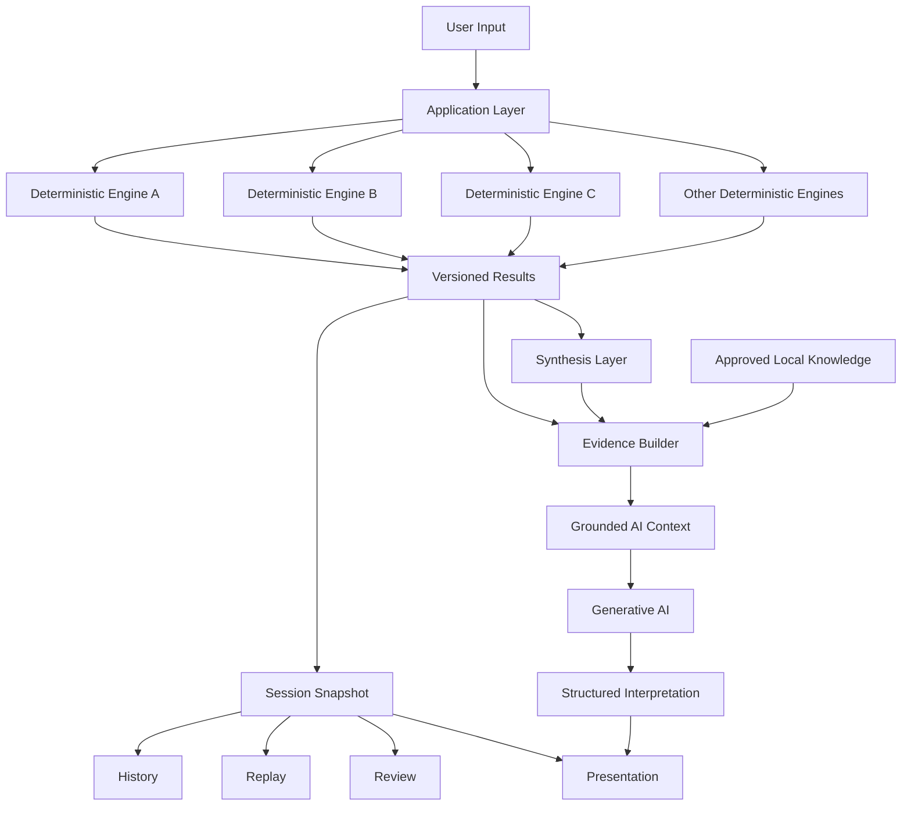
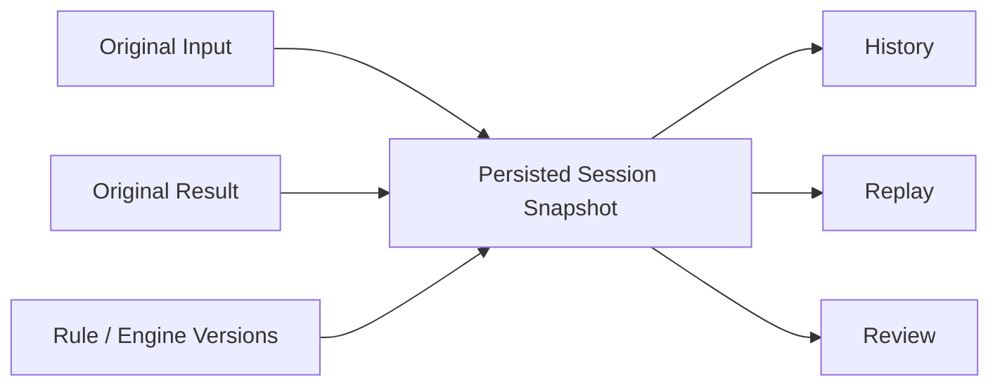
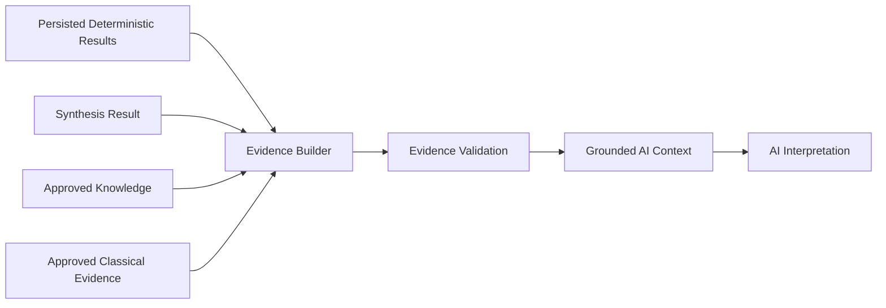
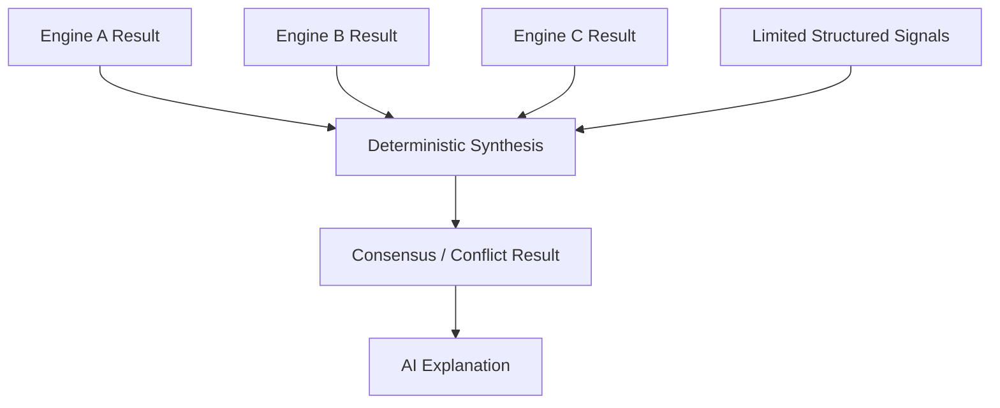
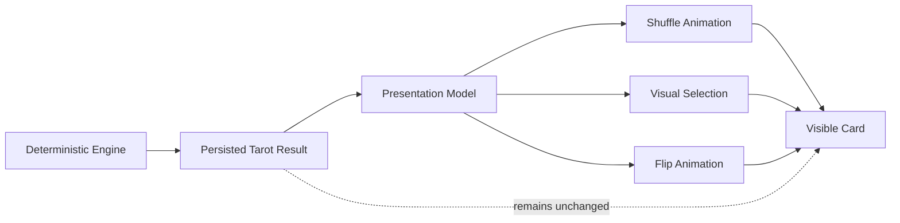
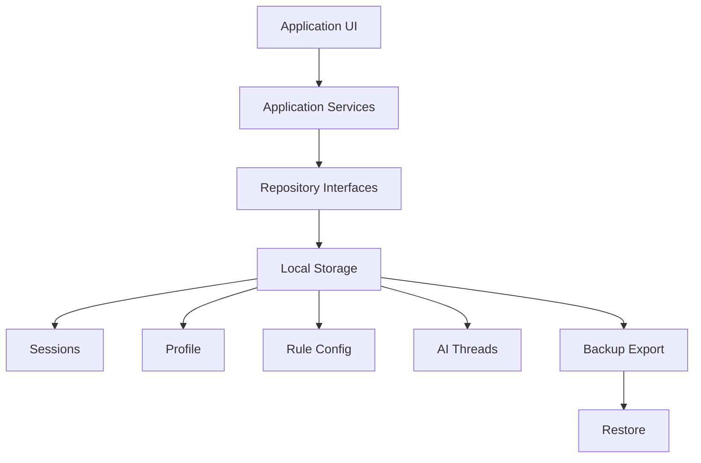
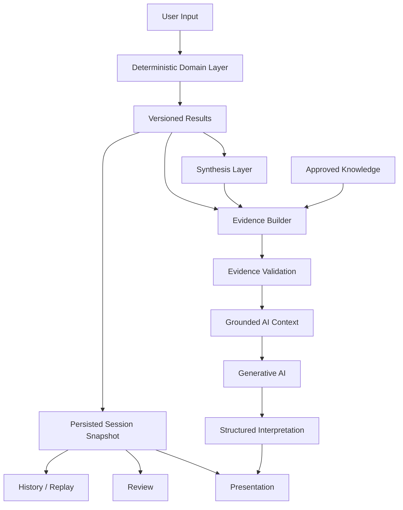

# Architecture Case Study

> How can a generative AI system explain application facts without becoming the source of those facts?

This document describes the application architecture behind **观象知微研习录 / Guanxiang Zhiwei**, a local-first AI-assisted traditional culture study workbench.

The project is used here as an AI application engineering case study.

Its main architectural goal is:

> **Keep deterministic computation, persisted history, evidence construction, and generative interpretation as separate responsibilities.**

---

## 1. The Problem

A simple AI application often looks like this:

```text
User Input
    ↓
LLM
    ↓
Answer
```

This works well for many conversational experiences.

However, it becomes problematic when an application also contains:

- deterministic domain rules
- persistent historical records
- versioned calculations
- reproducible results
- structured evidence
- multiple independent engines
- user-visible replay

In such a system, the LLM should not silently become the calculation engine, database, business-rule layer, and interpreter at the same time.

The architecture therefore separates:

```text
Fact Generation
Fact Persistence
Evidence Construction
AI Interpretation
Presentation
```

---

## 2. System Overview



The important point is that the AI is **downstream** from deterministic results.

It does not create the application truth that it is later asked to explain.

---

## 3. Deterministic / Generative Boundary

The most important boundary in the system is:

```text
Deterministic Domain
        |
        | approved structured context
        v
Generative Interpretation
```

### Deterministic side

The deterministic side owns facts such as:

```text
calculation result
selected card identity
card order
upright / reversed orientation
rule version
engine version
session input
historical snapshot
synthesis result
```

These values are generated by application-owned logic and persisted before AI interpretation.

### Generative side

The AI may:

```text
summarize
explain
compare
organize observations
produce structured interpretation
answer follow-up questions
```

The AI may not silently:

```text
change deterministic results
redraw a historical calculation
replace stored rule versions
select different Tarot cards
recalculate a historical Session
invent unsupported application facts
```

The principle is:

> **AI is an interpreter, not the source of truth.**

---

## 4. Versioned Deterministic Engines

Each deterministic engine is treated as an independent domain component.

Conceptually:

```text
Input
    ↓
Rule Configuration
    ↓
Deterministic Engine
    ↓
Versioned Result
```

A result is not only a value.

It also carries enough context to explain which rule set produced it.

Typical persisted metadata includes:

```text
input
result
ruleVersion
engineVersion
schemaVersion
seed
```

This makes the application more testable and provides a foundation for reproducibility.

---

## 5. Why Snapshots Matter

One of the main design decisions is:

> **Historical records should replay stored results, not recompute the past using today's state.**

Consider this scenario:

```text
Day 1
User Input
    ↓
Rule Version v1
    ↓
Result A
    ↓
Saved Session
```

Later:

```text
Day 90
Rule Version v2
Profile changed
Application upgraded
```

If History simply recalculates the old record, the application may now show:

```text
Old question
New rules
New profile
Different result
```

That is not replay.

That is a new calculation pretending to be history.

The project therefore uses:



Historical replay prioritizes the saved snapshot.

Current profile changes do not rewrite the past.

---

## 6. Session as the Reproducibility Boundary

The Session is one of the central application concepts.

A simplified model is:

```text
Session
├── id
├── createdAt
├── question
├── selectedEngines
├── inputs
├── deterministicResults
├── synthesisResult
├── ruleVersions
└── schemaVersion
```

The Session acts as the stable boundary between:

```text
calculation
persistence
history
review
AI context
presentation
```

This reduces coupling.

The AI layer does not need to know how every engine internally calculated its result.

The History layer does not need to call the engines again.

The presentation layer can render persisted state without altering domain truth.

---

## 7. Grounded AI Context

The AI does not receive unrestricted application state.

Instead, the application constructs an explicit context.



Conceptually:

```text
Application State
      ↓
Selection
      ↓
Approved Evidence
      ↓
Validation
      ↓
AI Context
      ↓
Structured Output
```

This is intentionally different from:

```text
Send everything to the model
        ↓
Hope the answer is grounded
```

---

## 8. Evidence Before Explanation

The evidence layer exists to answer:

> What is the AI actually allowed to claim?

Evidence may originate from:

```text
persisted deterministic results
synthesis conclusions
approved local knowledge
approved classical passages
```

Before entering the AI context, evidence can be filtered by application policy.

This provides a more explicit trust boundary:

```text
Domain Fact
    ↓
Evidence Candidate
    ↓
Policy / Validation
    ↓
Approved Evidence
    ↓
AI
```

As a result, prompt engineering is not the only protection against unsupported output.

Grounding is also enforced structurally by the application.

---

## 9. Synthesis Is Not an LLM Vote

The application contains multiple independent deterministic engines.

A tempting architecture would be:

```text
Engine Results
      ↓
LLM
      ↓
"Overall conclusion"
```

This project instead keeps synthesis as an application-owned layer.



The AI may explain a synthesis result.

It does not decide what counted as consensus after seeing free-form text.

This makes synthesis independently testable.

---

## 10. Limited Semantics

Another design principle is:

> Do not convert every domain detail into an AI scoring signal.

Only explicitly approved structural semantics should enter cross-engine synthesis.

This avoids a system where:

```text
more data
=
more arbitrary scoring
=
less explainability
```

Instead:

```text
Domain Result
    ↓
Narrow Mapping
    ↓
Structured Semantic Signal
    ↓
Synthesis
```

This keeps the synthesis contract intentionally small.

---

## 11. Presentation Must Not Change Domain Truth

Tarot Reveal is a useful example.

The deterministic engine decides the cards first.

```text
Deterministic Tarot Engine
        ↓
Persisted Tarot Result
        ↓
Reveal UI
```

The Reveal UI is only presentation.

The user may interact with card backs, animation, ordering of visual reveal, or reduced-motion controls.

But those interactions do not change:

```text
card identity
card order
upright / reversed orientation
stored result
seed
```

Conceptually:



The animation is allowed to change what the user sees next.

It is not allowed to change what the application already decided.

---

## 12. Adapter Boundary

External libraries are kept behind application-owned adapters.

The goal is:

```text
Application
    ↓
Project-owned Interface
    ↓
Adapter
    ↓
External Library
```

rather than:

```text
Application
    ↓
External Library API everywhere
```

Benefits include:

- reduced vendor coupling
- easier deterministic testing
- centralized configuration
- clearer upgrade boundaries
- easier replacement of third-party implementations
- protection of domain code from library-specific APIs

The application should depend on its own contract.

The adapter depends on the external library.

---

## 13. Local-first Architecture

The application is designed around local persistence.

Core state includes:

```text
Profile
RuleConfig
Sessions
AI Threads
Reviews
Backup
```

The main workflow does not require:

```text
user account
payment
social graph
mandatory cloud synchronization
```

This architecture was chosen because the product contains personal study history and replayable records.

Local-first also makes the persistence model explicit:



---

## 14. Backup and Replay Are Different Problems

Backup protects stored application data.

Replay protects historical meaning.

They solve different problems.

```text
Backup
=
Can I restore my stored application state?
```

```text
Replay
=
Can I see the historical result that was actually produced?
```

A robust application needs both.

Restoring a Session should preserve its stored deterministic identity rather than creating a new calculation.

---

## 15. AI Follow-up

Conversational AI introduces another state boundary.

A follow-up such as:

```text
"Explain the previous conclusion in more detail."
```

may reuse the existing deterministic context.

A request such as:

```text
"Recalculate this for tomorrow."
```

requires new deterministic input and therefore a new calculation.

The system distinguishes:

```text
Interpret Existing State
```

from:

```text
Create New Deterministic State
```

This prevents conversation continuity from silently becoming recalculation.

---

## 16. Testing Strategy

The architecture is designed so that the deterministic and generative layers can be tested separately.

Important regression categories include:

```text
deterministic engine fixtures
rule-version behavior
session integrity
historical replay
no-recalculation guarantees
synthesis rules
evidence validation
AI context boundaries
backup compatibility
presentation/domain isolation
asset manifest completeness
cross-platform builds
```

The project currently reports:

```text
Frontend
78 test files
657 tests

Server
4 test files
17 tests
```

The goal of these tests is not only code coverage.

They protect architectural boundaries.

For example:

```text
Reveal UI
must not call
Tarot Engine
```

and:

```text
Historical Replay
must not silently use
Current Profile
```

are architectural invariants that can be regression-tested.

---

## 17. Design Trade-offs

This architecture introduces more structure than a direct LLM application.

Instead of:

```text
Prompt
→ Response
```

the system contains:

```text
Domain Engines
Repositories
Snapshots
Evidence Builders
Validators
Synthesis
AI Context
Presentation Models
```

That increases implementation cost.

The benefit is greater control over:

```text
reproducibility
testability
historical integrity
AI grounding
debuggability
version migration
presentation/domain separation
```

This trade-off is worthwhile when the application contains facts that should remain stable even when the AI model, prompt, UI, or business rules evolve.

---

## 18. What the AI Does Not Own

A useful way to summarize the architecture is by ownership.

| Concern | Owner |
| --- | --- |
| Deterministic calculation | Domain engine |
| Rule version | Application configuration |
| Historical result | Session snapshot |
| Cross-engine consensus | Synthesis layer |
| Approved evidence | Evidence builder / validator |
| Interpretation | AI |
| Visual reveal | Presentation layer |
| Persistence | Repository layer |
| External library access | Adapter layer |

The model is only one component in the system.

It is not the application architecture.

---

## 19. Core Engineering Principles

### Deterministic before generative

If a fact can be computed deterministically, compute it before asking AI to interpret it.

### Snapshots before recalculation

History should preserve the state that actually existed.

### Evidence before explanation

AI context should be constructed from explicit approved evidence.

### Adapters before coupling

Third-party libraries should remain behind application-owned contracts.

### Presentation must not mutate truth

Animation and interaction may change presentation state, not deterministic state.

### Version before migration

Changing a rule should create a new version rather than silently rewriting historical meaning.

---

## 20. Final Architecture



The architecture can be summarized as:

> **Deterministic systems establish truth.  
> Persistence preserves truth.  
> Evidence constrains context.  
> AI explains truth.  
> Presentation communicates truth.**

---

## About This Case Study

This repository is a public engineering showcase.

The full private application contains additional implementation details, rule fixtures, internal release audits, local configuration, and development history that are intentionally not published here.

The purpose of this document is to demonstrate the architecture and engineering decisions without exposing private application data or credentials.
